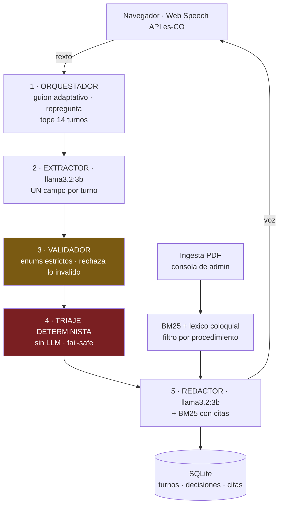

# Agente de voz para seguimiento postoperatorio

**Tech Sphere Challenge 2026** · Erwin Perez Montoya

Agente telefonico que llama a pacientes recien operados, conversa en espanol colombiano,
fundamenta sus respuestas en un corpus clinico y decide cuando alertar a personal humano.

| Entregable | Enlace |
|---|---|
| Informe final | [`INFORME.md`](INFORME.md) |
| Diagrama de arquitectura | [Ver diagrama](#arquitectura) (incluido en este README) |
| Video demo | [Demo funcional](https://youtu.be/iBF1ub5_yKQ) · [Preguntas de cierre](https://youtu.be/F4gLZ6xAQxA) |
| Metricas medidas | [`METRICAS.md`](METRICAS.md) |

---

## Stack declarado

| Componente | Eleccion | Nota |
|---|---|---|
| **Modelo de lenguaje** | **`llama3.2:3b` via Ollama** | De la lista permitida (G3) |
| Reconocimiento de voz (ASR) | Web Speech API del navegador | `es-CO`, sin descargas |
| Sintesis de voz (TTS) | Web Speech Synthesis API | `es-CO`, sin descargas |
| Recuperacion (RAG) | BM25 en Python puro + lexico coloquial | Sin embeddings, decision medida |
| Persistencia | SQLite | Sin servidor, archivo unico |
| API | FastAPI + uvicorn | |
| Interfaz | HTML + JavaScript vanilla | Una pagina, dos superficies |

**Por que `llama3.2:3b`:** se comparo contra Phi-3.5 Mini con un banco propio de 108
inferencias en el hardware de desarrollo. Llama gano en todas las metricas medidas:
100% residente en GPU (vs 74%), 65.6 tok/s (vs 25.4), P95 de 1109 ms (vs 1751 ms),
y 5/5 JSON validos (vs 3/5) sobre casos reales del dataset. Detalle en
[`METRICAS.md`](METRICAS.md) y en el informe.

**Sin claves de API.** El modelo corre localmente. Ver [`.env.example`](.env.example).

---

## Requisitos previos

- **Python 3.12** (probado en 3.12.10; 3.13+ no verificado)
- **Ollama** instalado y corriendo — https://ollama.com
- **Chrome o Edge** para la interfaz de voz (Firefox no soporta Web Speech API)
- Git

---

## Instalacion

Tiempo medido de extremo a extremo: **~7 minutos** con red de 20 MB/s.

### 1. Modelo (~2 GB, la descarga mas larga)

```bash
ollama pull llama3.2:3b
```

### 2. Clonar y preparar el entorno

```bash
git clone https://github.com/eperezmonto/agente-postoperatorio-techsphere.git
cd agente-postoperatorio-techsphere
```

**Windows (PowerShell):**
```powershell
py -3.12 -m venv .venv
.\.venv\Scripts\Activate.ps1
pip install -r requirements.txt
```

**Linux / macOS:**
```bash
python3.12 -m venv .venv
source .venv/bin/activate
pip install -r requirements.txt
```

### 3. Corpus clinico del reto

El corpus (107 PDFs, 128 MB) **no se incluye** en este repositorio: son obra de sus
respectivos autores y ya estan en el repositorio oficial del reto.

```bash
git config --global core.longpaths true
git clone https://github.com/TechSphere2026/ParticipantArtifacts.git kit
```

> `core.longpaths` es **necesario en Windows**: tres PDFs del corpus tienen nombres que
> superan el limite de 260 caracteres y `git` los omite en silencio sin esta opcion.

Verificar que llegaron los 107:

```powershell
(Get-ChildItem kit\dataset\textos -Recurse -Filter *.pdf).Count
```

### 4. Levantar

**Windows:** el servidor necesita su propia ventana; compartirla con otros comandos lo detiene.

```powershell
Start-Process powershell -ArgumentList '-NoExit','-Command',"cd '$PWD'; .\.venv\Scripts\Activate.ps1; uvicorn app.main:app --port 8000"
```

**Linux / macOS:**
```bash
uvicorn app.main:app --port 8000
```

Esperar a ver `Uvicorn running on http://127.0.0.1:8000`.

### 5. Ingerir el corpus

Abrir **http://localhost:8000** en Chrome → pestana **Consola de administracion** →
boton **Cargar corpus del reto**.

Tarda ~80 segundos. Resultado esperado: **106 indexados, 1 sin capa de texto, 5697 fragmentos**.

> El PDF no indexado (`REVISIÓN DE LA LITERATURA SOBRE LAAPENDICITIS...`) esta escaneado
> sin capa de texto. El sistema lo detecta, lo marca y lo declara en vez de ignorarlo.

Listo. La aplicacion esta operativa.

---

## Las dos superficies

Ambas viven en **http://localhost:8000**, en pestanas separadas.

### Interfaz de llamada

Seleccionar paciente → **Iniciar llamada** → el agente saluda por voz.
Responder con el boton **Hablar** (microfono) o escribiendo.

El panel derecho muestra en vivo: criticidad con las reglas disparadas, sintomas
capturados, fuentes citadas con su score, y al cerrar, el resumen estructurado con metricas.

### Consola de administracion

Subir un PDF → queda marcado **"procesado y disponible"** y el agente lo usa de inmediato.
Eliminarlo → el indice se reconstruye y el agente lo olvida.

Incluye una tabla de **cobertura por procedimiento** que declara para cuales hay corpus valido.

---

## Arquitectura



**Regla invariante: cualquier capa puede subir la criticidad; ninguna puede bajarla.**

### El LLM no decide la gravedad

El modelo hace dos cosas: **extraer** sintomas estructurados del lenguaje ambiguo del
paciente, y **redactar** prosa empatica. La decision clinica la toma un motor
deterministico con reglas auditables.

Esto no es una preferencia de estilo. Se midio: pidiendole al modelo los cuatro campos a
la vez, ante *"un poquito molesto no mas, uno aguanta"* devolvio `dolor=2`,
`herida="normal"`, `movilidad="limitada_esperada"` — **tres de cuatro campos alucinados**,
incluyendo afirmar que una herida estaba bien cuando nadie la habia mirado.

### Fail-safe: la ausencia de dato nunca empuja a verde

Si falta un dato critico, se escala. Si faltan dos o mas, el cuadro se declara
**no evaluable de forma remota** y se alerta a un humano.

### El agente persigue lo que no le dicen

La extraccion posterior a la llamada **no puede recuperar lo que la conversacion nunca
capturo**. Una paciente con dolor 9/10 que dice *"un poquito molesto"* no tiene un 9 en
ninguna parte del texto. La reparacion no es mejor extraccion: es **repreguntar en vivo**.

> *"Necesito el numero. Si 10 es el peor dolor que ha sentido en su vida, ¿donde esta hoy?"*

Maximo 2 reintentos por campo. Agotados, se escala por dato faltante.

---

## Metricas medidas

Hardware: Windows 11 · RTX 3050 (4 GB VRAM, ~3 GB utiles) · 64 GB RAM.
Configuracion: `num_ctx=2048`, `top-k=3`, 100% del modelo residente en GPU.

### Llamada completa real

| Metrica | Valor |
|---|---|
| Turnos | 11 |
| Invocaciones al LLM | 11 |
| **Latencia LLM P50** | **2059 ms** |
| **Latencia LLM P95** | **3302 ms** |
| Tokens entrada / salida | 3724 / 322 |
| Documentos citados | 2 |

> Estas cifras son **solo del LLM**. La latencia percibida por el paciente incluye ademas
> el reconocimiento de voz y el arranque del sintetizador del navegador.

### Consumo por turno

Dos invocaciones al modelo por turno: una para extraer, otra para redactar.
Promedio: ~339 tokens de entrada y ~29 de salida por invocacion.

### Costo estimado por llamada

**Costo real: 0 USD.** El modelo corre localmente sobre hardware propio.

Extrapolado a precios de API publicos para un modelo de escala equivalente
(referencia: ~0.10 USD por millon de tokens de entrada, ~0.40 de salida):

```
(3724 / 1e6) × 0.10  +  (322 / 1e6) × 0.40  ≈  0.00050 USD por llamada
```

Aproximadamente **medio milesimo de dolar**, o unas **2000 llamadas por dolar**.
El calculo usa los tokens reales medidos; los precios son de referencia publica y varian
por proveedor.

### Motor de triaje — validado contra los 160 casos con ground truth

| | |
|---|---|
| Exactitud | 81.2% |
| **Falsos negativos (rojo perdido)** | **0 de 12** |
| Amarillo degradado a verde | 0 de 25 |
| Verde sobre-escalado | 30 de 123 |

La sobre-escalacion es deliberada. La rubrica define el falso negativo como la falla
catastrofica; escalar de mas cuesta una llamada, escalar de menos cuesta un paciente.
Se probo una version con umbrales por dia postoperatorio que subia a 86.9%, pero
introducia 3 amarillos degradados a verde. **Se descarto.**

---

## Auditoria del corpus

El corpus entregado contiene cuatro problemas. Los cuatro se detectan y se declaran:

| Hallazgo | Tratamiento |
|---|---|
| PDF escaneado sin capa de texto | Detectado por densidad de texto, marcado, no indexado |
| PDF cifrado con AES | Requiere `cryptography`, declarada en `requirements.txt` |
| Carpeta `breast_cancer` mal etiquetada | **Contiene cancer de cuello uterino, no de mama** |
| Documento duplicado con nombre truncado | `ecommendations...` vs `Recommendations...`, 99% identicos |

El tercero tiene consecuencia clinica directa: el dataset incluye **8 pacientes con
mastectomia** y **no existe corpus valido para ese procedimiento**. El sistema lo declara
y escala en vez de responder con protocolos de otra patologia.

Verificable en la consola: tabla **Cobertura por procedimiento**.

---

## Limitaciones conocidas

- **El ASR del navegador comete errores en espanol colombiano.** En pruebas reales,
  *"muy mal"* se transcribio como *"animal"*. El sistema lo absorbe: sin numero explicito
  el extractor devuelve `null` y el agente repregunta, en vez de inventar un valor.
- **La Web Speech API envia audio a servidores de Google.** Para despliegue hospitalario
  se sustituiria por ASR/TTS local (Whisper + Piper), a costa del tiempo de arranque.
- **Sin OCR.** El PDF escaneado se declara en vez de procesarse; Tesseract requiere un
  binario del sistema que comprometeria el tiempo de instalacion.
- **Recuperacion lexica, no semantica.** Ver la nota sobre bge-m3 en el informe.
- **Sin autenticacion.** Fuera del alcance declarado por el reto.

---

## Estructura

```
app/
  main.py          API FastAPI · endpoints de llamada y administracion
  orquestador.py   maquina de estados de la llamada · repregunta
  extractor.py     llamadas a Ollama · extraccion y redaccion
  esquema.py       validacion estricta de enumerados
  triaje.py        motor deterministico de criticidad
  bm25.py          recuperacion lexica en Python puro
  lexico.py        traduccion coloquial colombiano -> clinico
  cobertura.py     mapeo procedimiento -> corpus · validacion
  ingesta.py       procesamiento de PDF · idempotente por sha
  chunking.py      segmentacion semantica
  llamadas.py      persistencia y resumen estructurado
  db.py            esquema SQLite
  static/index.html   las dos superficies
bench.py           banco de latencia (evidencia)
calidad.py         banco de calidad de extraccion (evidencia)
METRICAS.md        todas las mediciones
```

---

## Licencia

MIT — ver [`LICENSE`](LICENSE).

Los PDF del corpus del reto son obra de sus respectivos autores y **no se distribuyen**
en este repositorio.
